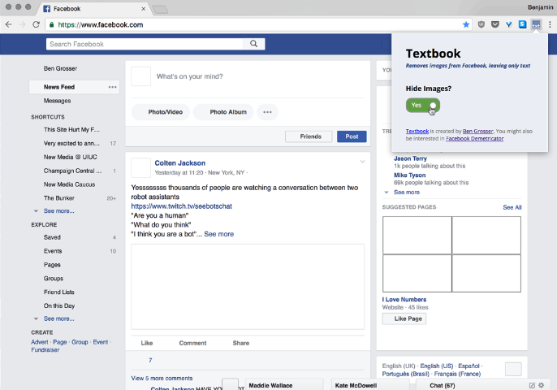

Plugin *Textbook*[^4] zavádza drobnú frikciu: odoberá používateľovi vizuálne skratky, ktoré mu umožňovali „čítať“ obsah bez vedomého čítania. Maže obrázky a ikony, no ponecháva po nich prázdne štvorce – viditeľné stopy poukazujúce na množstvo vizuálnych informácií, s ktorými bežne interagujeme. Narúša tak zaužívaný rytmus pasívneho listovania – vytvára [[diskomfort]], ktorý nás núti prejsť do režimu aktívneho skúmania.

*Zdroj: Ben Grosser, 2017,*&nbsp;

[^4]: GROSSER, Ben. _Textbook._ \[online]. 2017. \[cit. 31. 12. 2025] Dostupné z: https://bengrosser.com/projects/textbook/](https://bengrosser.com/projects/textbook/)