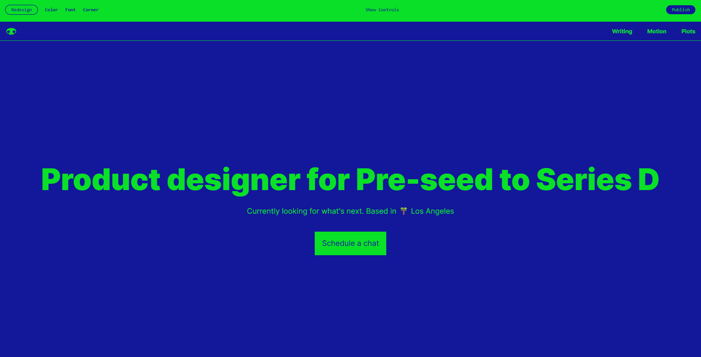
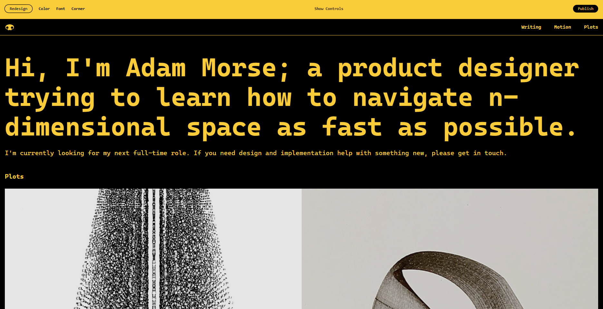

Cieľom navrhnutých odporúčaní[^3] je sústrediť sa na obsah a vyhnúť sa vizuálnym prvkom, ktoré priamo nezjednodušujú navigáciu. Ideálny web na ich základe pozostáva z hierarchicky rozdeleného textu v prípade potreby doplneného tlačidlami a hypertextovými odkazmi.

*Zdroj: Adam Morse, 2025,*

*Zdroj: Adam Morse, 2025,*

[^3]:  COPELAND, David Bryant. _Brutalist Web Design._ \[online]. 2025. \[cit. 31. 12. 2025]. Dostupné z: [https://brutalist-web.design/](https://brutalist-web.design/)
