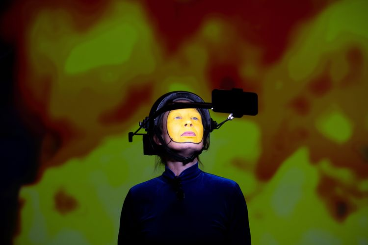

Performancia[^1] založené na manifeste [[Designing Friction]][^2] zavádza frikciu ako nástroj pre autenticitu. Predstavuje zmenu paradigmy v tom, ako navrhujeme digitálne technológie a ako s nimi pracujeme. S tvárou namaľovanou na žlto Luna Maurer vytvára metaforu, v ktorej emotikon symbolizuje plynulú a pohodlnú digitálnu komunikáciu, ktorá v skutočnosti redukuje komplexnosť ľudských interakcií. Týmto spôsobom zpochybňuje predstavu, že odstránenie všetkých prekážok vedie k lepšej používateľskej skúsenosti. 

*Zdroj: PublicSpaces, 2024,*

[^1]: MAURER, Luna. _Emoticons Don’t Have Wrinkles._ \[online]. \[cit. 4. 1. 2026]. Dostupné z: [https://vimeo.com/1073615086](https://vimeo.com/1073615086)

[^2]: MAURER, Luna; WOUTERS, Roel; BARANCOVÁ, Alexandra. _Designing Friction._ \[online]. 2023. \[cit. 31. 12. 2025]. Dostupné z: [https://designingfriction.com/](https://designingfriction.com/)
